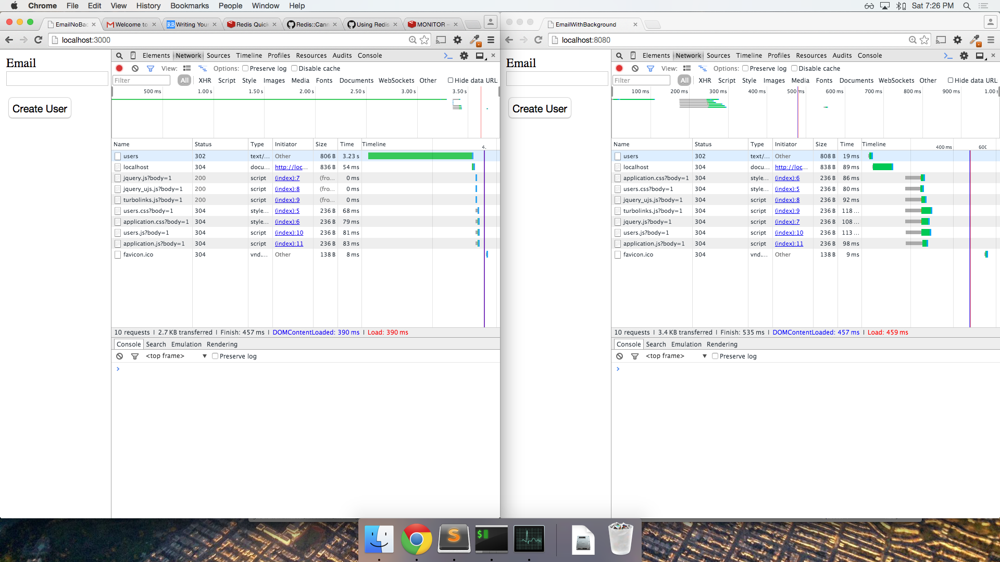

# thunder-talk

A simple experiment with background processing...

This repository includes the following:

1. A simple Rails web application that sends an email to the user upon signup without any background process

2. The same Rails web application with a background process to perform the email delivery

Background processing is implemented as follows:

* Leverage the Sidekiq gem for background processing
  * Add it to the Gemfile, and run 'bundle exec'
  * Drop 'deliver', and add 'delay' for the email notification in the users controller

* Add Redis to run the background process delegated by Sidekiq
  * Install it with 'brew install redis'
  * Start it with 'redis-server'
  * Monitor it with 'redis-cli monitor'

Here we have a side by side network comparison of the app running with and without the background process:

Description: The top green bars in both browser windows represent the time required for the request on submit to complete. In the first case, the email notification is not being delegated to a background process hence the delay. In the second case, the email notification is being delegated to a background process therefore the request is no longer being delayed. In the second case, the process was delegated to a worker virtual machine (redis server).
